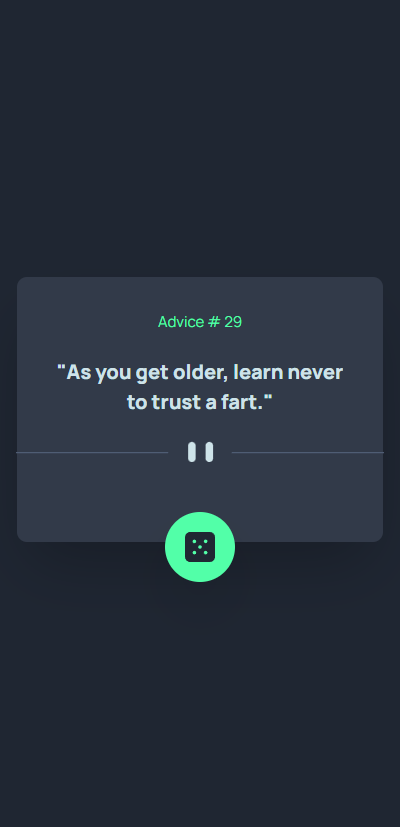
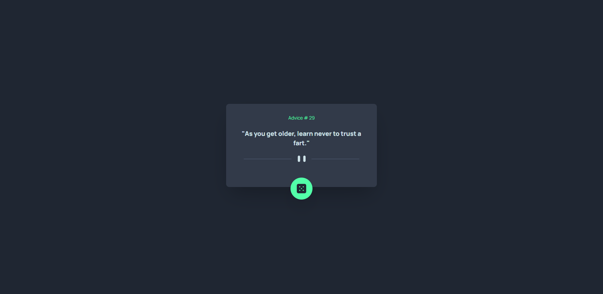

# Advice generator app

Advice generator app

## Table of contents

- [Advice generator app](#advice-generator-app)
  - [Table of contents](#table-of-contents)
  - [Overview](#overview)
    - [What can you do:](#what-can-you-do)
    - [Screenshot](#screenshot)
    - [Links](#links)
  - [My process](#my-process)
    - [Built with](#built-with)

## Overview

### What can you do:

- View the optimal layout for the app depending on their device's screen size
- See hover states for all interactive elements on the page
- Generate a new piece of advice by clicking the dice icon

### Screenshot

### Links

- GitHub Code URL: (https://github.com/aguilcasariki/advice-generator-app/tree/main)
- Live Site URL: (https://your-advice-generator.vercel.app/)

## My process

### Built with

- Semantic HTML5 markup
- CSS custom properties
- Flexbox
- CSS Grid
- Mobile-first workflow
- React.js (https://react.dev/)
- TailwindCSS (https://tailwindcss.com/)
- React Query (https://tanstack.com/)
- Advice Slip API(https://api.adviceslip.com)
- Google Fonts (https://fonts.google.com/)
- Favicon.io (https://favicon.io/)
